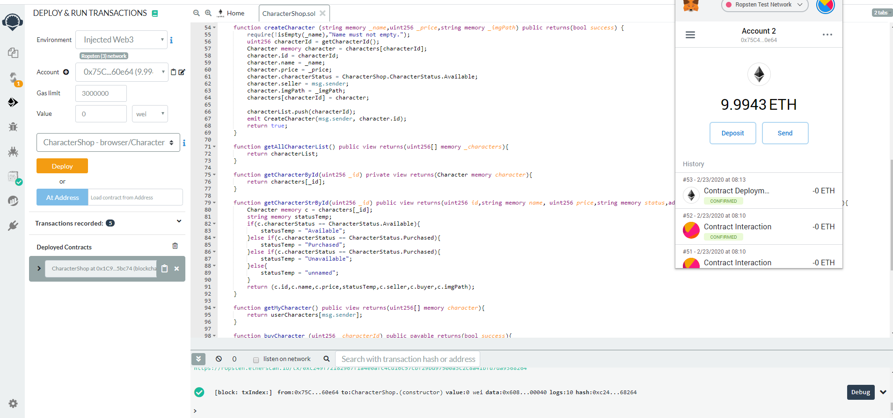
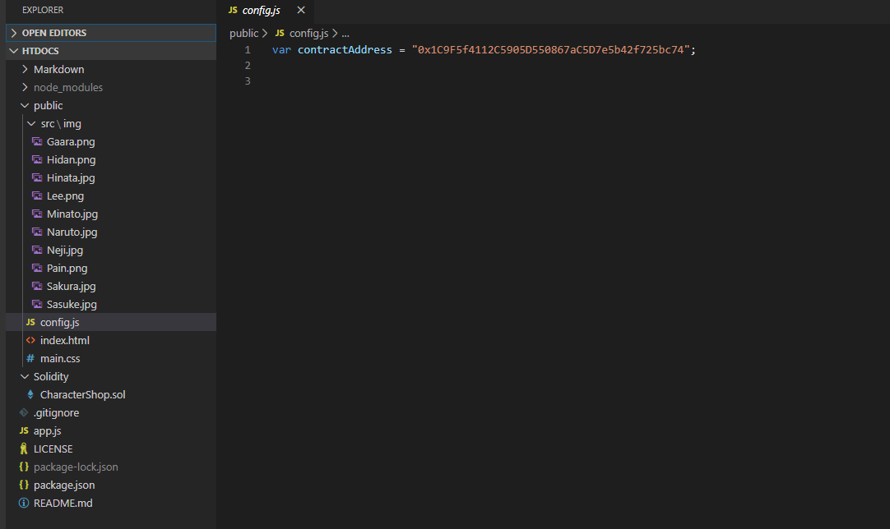
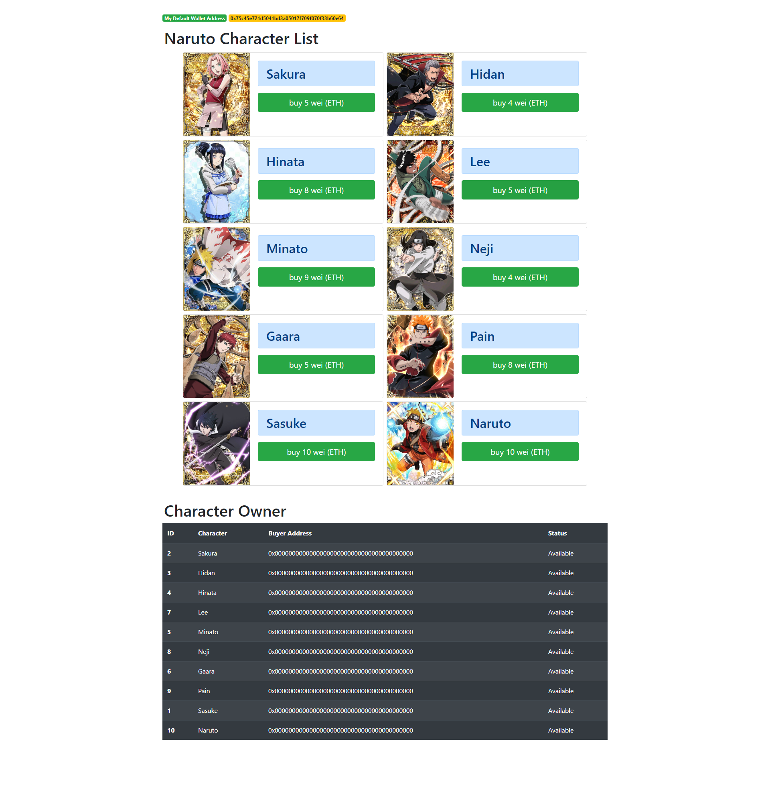
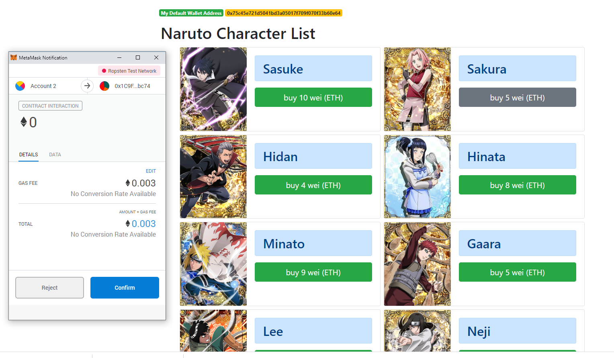
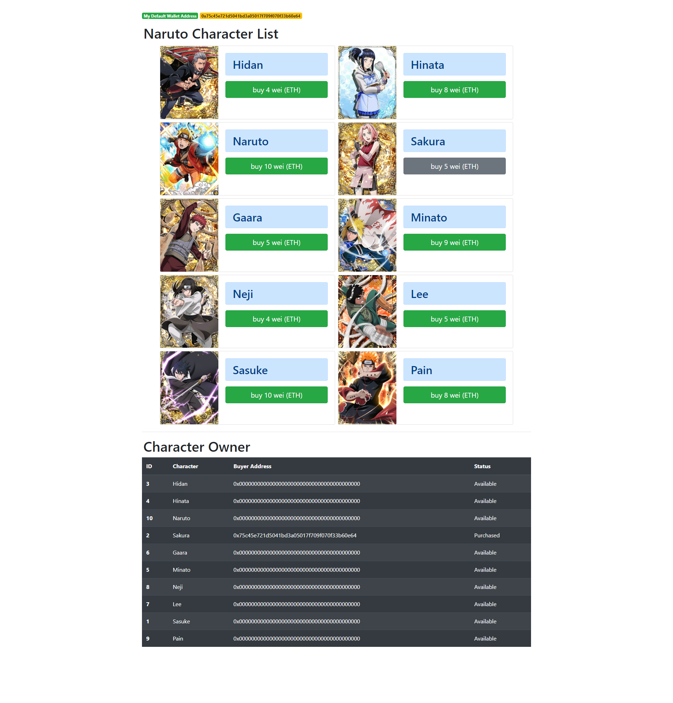
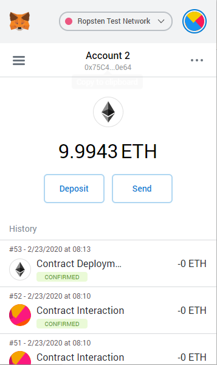

# Smart-Contract-WebShop
Simple web shopping using Smart Contract on Ethereum Test network.

## Getting start

    require
    1. [nodejs] download from here https://nodejs.org/en/
    2. [remixIDE https://remix.ethereum.org/] to publish contract
    3. [metamask chrom plugin] to be virtual Wallet

 ### Upload Smart Contract
 1. go to path Solidity/CharactorShop.sol
 2. upload to https://remix.ethereum.org/
 3. DEPLOY & RUN TRANSACTIONS with Injected Web3 with your MetaMask account (I used Ropsten Test Network).
   
   </img>

 4. Copy your Contract Address to file path public/config.js

    </img>

 ### Start Web Server
 1. `git clone https://github.com/ToeiKanta/Smart-Contract-WebShop.git`
 2. `cd Smart-Contract-WebShop`
 3. `npm install`
 4. `node start`
 5. Open Web Browser on http://localhost/

</img>

 6. Having fun..

## All Screenshot
### Before
</img>
### Pending
</img>
### After
</img>
### Matamask
</img>
### RemixIDE
</img>